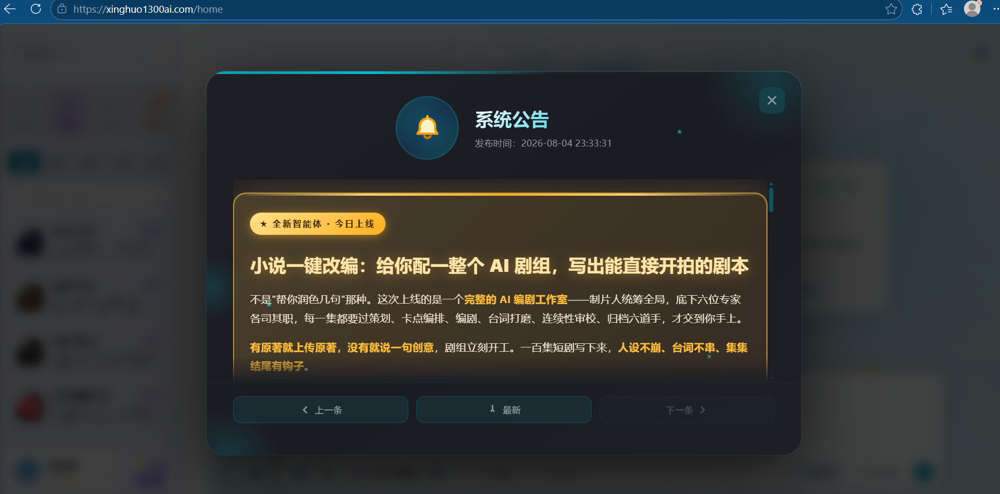
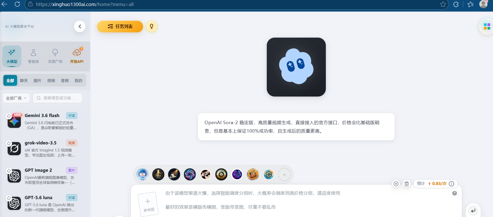
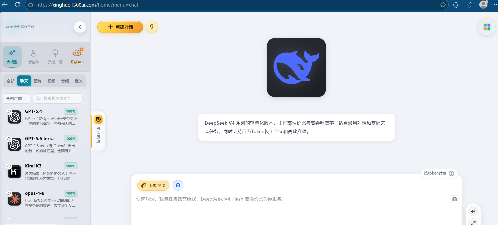
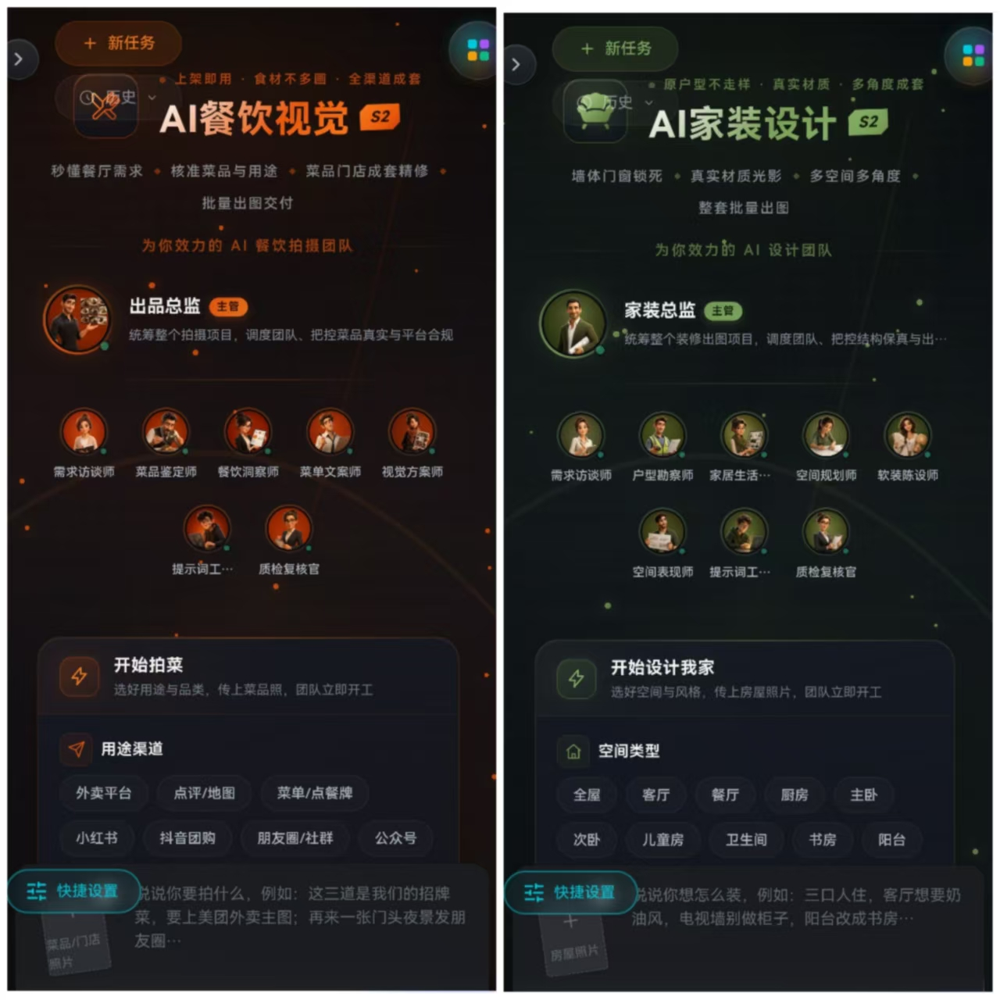
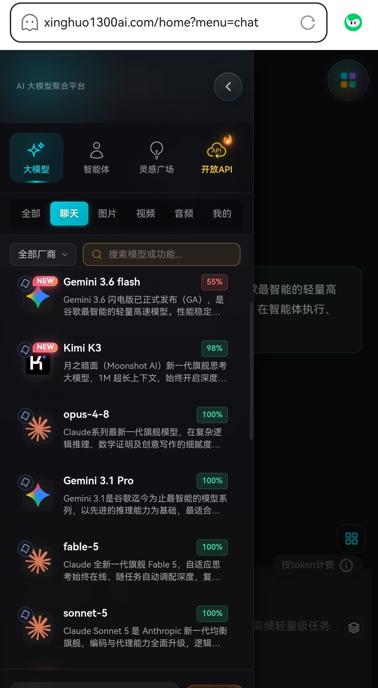
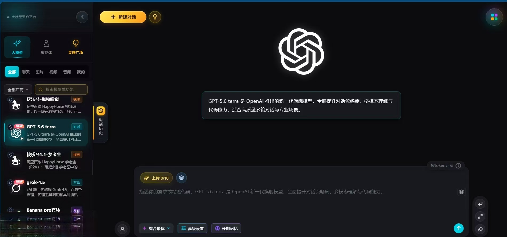

# 🚀 AI Model Hub — One Dashboard for Every Top AI Model

Access **Gemini 3.6 Flash, GPT-5.6 Luna, Grok-Video 3.5, Sora 2, GPT Image 2, DeepSeek V4 Flash, Seedance 1.5 Pro** and more — all from a single dashboard.

🌐 **https://xinghuo1300ai.com**

---

## ✍️ AI Screenwriting Studio

Turn any novel into a shoot-ready screenplay. A full virtual crew — producer, script doctors, continuity editors — assembles a production-ready script.

## 🧩 Every Flagship Model

No more tab-switching between providers. One login, one balance.

## ⚡ DeepSeek V4 Flash

Long-context inference at a fraction of the cost — built for production workloads.

## 🎨 Inspiration Gallery

Browse real AI-generated artwork with the prompts that made them. One click to remix.

## 🤖 Collaborative AI Agents

Multi-agent workflows where specialized roles co-create theme-driven content.

## 🎬 Seedance 1.5 Pro

Cinematic video generation with built-in sound and music.

---

## Why consolidate?
Skip 5+ monthly subscriptions. Pay per use across every model with one API.

⭐ Star this repo if it helped you discover a new model!

---

## 📚 Related

- 🌐 Platform: https://xinghuo1300ai.com
- 📝 Dev.to article (@lijingbig): https://dev.to/lijingbig/i-replaced-5-separate-ai-subscriptions-with-one-dashboard-heres-the-full-breakdown-16ge
- 📝 Dev.to article (@caicaibigtige): https://dev.to/caicaibigtige/from-novel-to-shoot-ready-screenplay-inside-the-ai-screenwriting-studio-video-pipeline-2p08
- 💻 Mirror repo: https://github.com/caicaibig-tige/ai-model-hub
